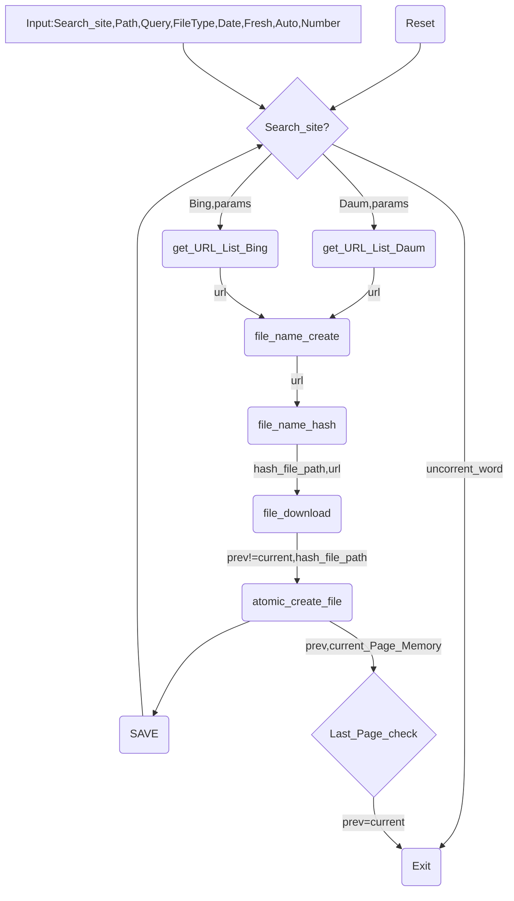

# 크롤러 소개 및 사용법
## 크롤러 소개
### Daum 크롤러
* 목적: Daum의 웹페이지에서 원하는 파일 포맷을 가진 url을 다운받기 위함을 목표로 한다.

### Bing 크롤러
* 목적: Bing의 웹페이지에서 원하는 파일 포맷을 가진 url을 다운받기 위함을 목표로 한다.

* * *

## 크롤러 사용법
--------------------------
###목차
[TOC]

--------------------------
###실행법

* 사용법
```
crawler_V_1.py  -s [daum|bing] -q QUERY_STRING -p FILE_PATH -t FILE_TYPE -d [all|month|week|day] (-a) (-n NUMBER)
python3 crawler_V_1.py -s [daum|bing] -q QUERY_STRING -p FILE_PATH -t FILE_TYPE -d [all|month|week|day] (-a) (-n NUMBER)
```

* Options
    * -s ,--site: 검색할 사이트 명. 현재는 Daum과 Bing 그리고 google이 된다. (필수)
    * -q ,--query: 검색할 검색어 명. 검색하고 싶은 단어를 입력한다. 만약 auto기능을 사용할 경우에는 query값을 무시한다. (필수)
    * -p ,--path: 저장시킬 폴더명.  예를 들면 c:/downloadFolder/를 입력한다. (필수)
    * -t ,--type: 검색할 검색어의 파일 유형. DAUM과 BING은 DOC, XLS, PPT, PDF, TXT를 검사할 수 있으며 DAUM만 HWP를 검색할 수 있습니다. (필수)
    * -d ,--date : 시간 순으로 정렬. BING과 google에서만 사용 가능한 옵션으로 day, week, month, all이 있다.
	* -a ,--auto: 쿼리어를 인터넷의 단어를 통해서 얻어와 자동적으로 입력해주는 기능입니다. 생략이 가능합니다.
	* -n ,--number: 파일의 갯수를 카운트하여서 해당 갯수만큼 파일을 받도록 하는 기능입니다. 생략이 가능합니다. 기본값은 1000입니다.
	* -c ,--clear : 로그를 갖고 디스크를 검사하는 기능입니다. 생략이
	
    
	Example>
	
 	윈도우 Daum: crawler_V_1.py -s daum -q "hwp" -p c:/folder_name/ -t hwp
 	윈도우 Bing: crawler_V_1.py --site bing -query "" --path d:/folder_name/ --type doc --date day --auto
     리눅스 Daum: python3 crawler_V_1.py -s daum -q "고라니" -p /home/downloads/folder_name/ -t ppt
     리눅스 Bing: python3 crawler_V_1.py --site bing --query "" --path /home/downloads/folder_name --type ppt --date week --auto
	
    
--------------------------

###입력 변수
####Search_site
대소문자 구분 없이 Bing이나 Daum을 입력하시면 됩니다.

####Path
파일 경로는 입력한 앞의 첫 글자를 자신이 사용할 드라이브의 위치로 파악을 합니다. 파일의 구분은 \를 하지 않고 /로 사용을 합니다.
마지막 경로에는 항상 /를 붙이고 그렇지 않을 경우에 오류를 출력합니다.

####Query
Query는 자신이 찾고자 하는 검색어를 입력하는 부분입니다. -q "검색어" 또는 -q 검색어 를 사용하는데 전자의 경우가 옳은 표현입니다.

####FileType
파일 타입은 자신이 검색할 파일의 타입을 입력하는 부분입니다.

파일유형|Bing|다음|Google
:---|:---:|:---:|:---:
HWP| X | O |O
DOC| O | O |O
DOCX|X|O|O
PPT| O | O|O 
PPTX|X|O|O
XLS| O | O|O
XLSX|X|O|O
PDF| O | O|O 
TXT| O | O |O

Bing은 pptx,docx,xlsx를 검색할 수 없습니다. 단순히 ppt, doc, xls가 검색이 가능합니다.
또한 Bing에서는 hwp를 검색할 수 없습니다.

####Freshness
Freshness는 Bing과 Google에서만 사용할 수 있는 입력 변수입니다.
전체, 1달, 1주일, 1일 단위로 검색할 수 있으며 각각 all, month, week, day로 입력해주시면 됩니다. 

####Auto
Query어를 자동적으로 입력 할 수 있도록 사용하는 변수입니다. --auto 또는 -a를 입력시에 계속해서 검색할 수 있도록 검색어를 추출한 후에 자동적으로 쿼리에 입력해줍니다. auto는 hisotry로그에 1주일 안에 검사했었던 기록이 있다면 중복해서 검사하는 것을 피하도록 합니다.

####Number
받고 싶은 파일의 갯수를 설정하는 변수입니다. --number 또는 -n와 함께 숫자를 입력하게 되면 받고 싶은 갯수의 파일을 카운트하면 파일을 받고 해당 파일 갯수보다 많이 받게 될 경우에는 프로그램을 자동으로 종료시켜줍니다.

----------------------------

### 순서도

### Bing 크롤러 관련 도움말
#### 사용하는 API
현재 사용하고 있는 API는 Bing Search v5 API중에서 WebSearch에 관련된 API를 사용하고 있습니다.

#### 한계성
Bing-API는 1달마다 1천개의 쿼리문을 처리할 수 있습니다. 쿼리문당 출력할 수 있는 url의 갯수는 50개이므로 1달에 최대 50000건의 URL을 파싱할 수 있습니다. https://www.microsoft.com/cognitive-services/en-US/subscriptions에서 Quota값을 통해서 자신의 사용량을 볼 수 있습니다. 하루에 약 15000개에서 20000개를 다운받고 3개월까지만 무료로 제공해주기 때문에 현실적으로 사용할 가능성이 없습니다.

#### Key값
키값은 https://www.microsoft.com/cognitive-services/en-US/subscriptions에서 key1이나 key2값을 확인 한 후에 해당 key값을 request해주면 됩니다. headers = {'Ocp-Apim-Subscription-Key': '2026d73832ba4415ac2f838eecc30175'}와 같이 헤더 값에 key값을 입력해서 request에 header값을 붙여서 보내는 방식을 사용하고 있습니다.

#### Reference
Bing-API에 관련된 Header, Parameter등의 Reference는 https://msdn.microsoft.com/en-us/library/dn760794.aspx에서 정보를 얻을 수 있습니다.

### Daum 크롤러 관련 도움말
#### 사용하는 API
Daum의 크롤러는 API를 사용하고 있지 않으며 HTML을 받아와서 분석하고 있습니다.

#### 한계성
Daum크롤러의 한계성은 수 많은 검색량이 있지만 실제로 Daum에서 제공해주고 있는 검색량은 약 100페이지 정도입니다. 따라서 한 번 검색을 하게 되면 페이지당 10개, 10*100=1000개의 Url을 가져올 수 있습니다. 하지만 쿼리의 제한은 갖고 있지 않습니다.

###로그 관련 도움말
로그는 성공한 로그, 성공과 실패한 로그, 검색 기록 총 3가지의 로그 파일을 생성하고 있습니다.

### Google 크롤러 관련 도움말
#### 사용하는 API
현재 사용하고 있는 API는 Google Custom Search입니다.

#### 한계성
Google크롤러는 무료인 대신에 하루에 처리할 수 있는 쿼리양은 100개밖에 되지 않습니다. 따라서 parameter에 화면당 출력할 수 있는 num은 10개가 한정입니다. 하루에 총 처리할 수 있는 url의 갯수는 1000개입니다.
하지만 Google크롤러는 날짜를 지정할 수 있으며 수 많은 자료를 갖고 있는 크롤러입니다.

####Key

cx는 검색엔진의 ID를 뜻합니다. https://cse.google.com/cse에서 결과값을 얻어올 수 있습니다.
cx위치: 검색엔진 수정-> 만들어진 엔진 -> 설정 -> 세부정보 -> 검색 엔진 ID
key는 사용자인증정보입니다. https://console.developers.google.com/apis/credentials에서 API키값입니다.
the API provides 100 search queries per day for free. Additional requests cost $5 per 1000 queries, up to 10k queries per day. 하루에 100쿼리, num=화면당 출력할 수 있는 갯수는 10개까지 입니다.

####parameter 정보
https://developers.google.com/custom-search/json-api/v1/reference/cse/list에서 구체적인 정보를 구할 수 있습니다.
이 크롤러에 사용하고 있는 parameter는 
query: 찾고자하는 검색어입니다.
dateRestrict: d,w,m,y의 변수를 갖고 앞에 숫자n을 붙인다. 예를 들면 dn이면 몇 일 전까지의 결과만 출력, wn이라면 주 전까지만의 결과만 출력을 하도록 한다. 처음 커맨드에서 입력하는 day,week,month,all에 따라서 각 값들을 if문으로 처리하고 있습니다.
start: 출력되는 인덱스 번호입니다. 0부터 시작되지만 0일 경우에는 start 변수를 제외하고 request를 해야한다. 
filetype: query문을 통해서 제어를 해야합니다. doc,hwp,ppt,pptx,doc,docx,xls,xlsx,pdf,txt등 다양한 파일 유형을 제공합니다.

####대시보드
https://console.developers.google.com/apis/dashboard?project=trans-trees-137301 이 곳에서 자신이 얼마나 사용을 했는지 대시보드를 통해서 볼 수 있습니다.


####Success_Log_File
성공한 로그 파일은 아래와 같이 URL이 저장이 됩니다.

[시간] 성공여부 검색어	URL 파일경로

```
[2016-08-05_09:52:27]	Done	검색어	http:\\www.naver.com	c:/downloadFolder/abcdefgdg.hwp
```

####Total_Log_File
모든 로그 파일은 아래와 같이 저장이 됩니다.
[시간] 성공여부	검색어	 URL 파일경로 (에러메시지)
```		
[2016-08-05_09:52:27]	Done	검색어	http:\\www.naver.com	c:/downloadFolder/abcdefgdg.hwp
[2016-08-05_09:52:27]	Fail	검색어	http:\\www.naver.com	c:/downloadFolder/abcdefgdf.hwp Error code
```

####Search_Word_history
검색어를 저장하는 로그파일은 아래와 같이 저장이 됩니다.
[시간] 사이트 검색어 파일타입 페이지수
```
[2016-08-05_13:52:15]	daum	안녕하세요	hwp   1p			
```

####주의사항
 프로그램에서 로그폴더를 항상 해당 다운로드 경로의 logs폴더로 인식하고 있습니다. 그렇기 때문에 만약에 해당 경로가 바뀌게 된다면 새롭게 폴더를 만들어서 새로운 로그파일을 만들 것이고 새로운 로그파일엔 아무것도 적혀있지 않기 때문에 해당 프로그램은 폴더에 있는 모든 파일을 삭제할 것입니다. 따라서 사용하는 사람은 log폴더의 경로를 수정하기 전에 한 번 더 생각하고 수정해야 합니다.
    
###  Module
```
import urllib.request  #요청을 보내서 html을 받아오는 lib 
import os  #파일 생성 및 유지에 필요한 lib
import requests  #get을 보내기 위해서 사용하는 lib
import re  #파일의 이름을 정규표현식을 사용하기 위해서 사용하는 lib
import time  #현재의 시간을 구하기 위해서 사용하는 lib
import datetime  #현재의 시간을 구하기 위해서 사용하는 lib
import hashlib  #파일제목을 hash를 통해서 재설정함
import socket  #timeout 관련 예외처리 lib
import sys  #sys.argv에 사용하기 위한 lib
import http  #http.client.RemoteDisconnected오류를 처리하기 위한 lib
import ssl  #ssl오류를 처리하기 위한 lib
from bs4 import BeautifulSoup  #받아온 html을 분석하기 위한 lib (다운로드 필요)
import json #json으로 bing_request를 묶기 위해서 사용하는 lib
import argparse #명령 인자를 받아오는 lib
from _socket import gaierror	#gaierror에러를 처리하기위해서 사용하는 lib
import io	#utf-8로 파일을 저장시키기 위해서 io.open을 사용해주고 encoding='utf-8-sig'로 저장합니다.
import random	#임의로 단어를 추출하여 검색어를 사용하기 위해서 사용하는 lib
from collections import OrderedDict#배열의 값들을 중복 제거하기 위한 lib (다운로드 필요)
```

### Except
####오류 목록
```
urllib.request.urlopen(url, timeout=10)에서 오류가 발생합니다.
ConnectionResetError는 [WinError 10054] 현재 연결은 원격 호스트에 의해서 강제로 끊겼습니다. 라는 오류를 냅니다.
ConnectionAbortedError는 fname,header = urllib.request.urlretrieve(url,file_path)에서 오류 발생합니다.
ConnectionAbortedError는 Winerror 10053 현재 연결이 호스트 시스템의 소프트웨어에 의해 종료시에 오류 발생.
ssl.CertificateError는 hostname 'abc.go.kr' doesn't match '*.argc.go.kr'라는 오류를 입니다.
ssl.CertificateError는 a=urllib.request.urlopen(url,timeout=10)에서 발생합니다.
urllib.error.URLError는 <urlopen error timed out>과 같은 오류를 발생시킵니다.
urllib.error.URLError는 urllib.request.urlopen()에서 발생합니다.
socket.timeout는 urllib.request.urlopen()에서 설정한 timeout보다 시간이 초과되면 발생하는 오류입니다.
socket.timeout는 a=urllib.request.urlopen(url,timeout=10)에서 발생합니다.
urllib.error.HTTPError는 http error가 일어난다면 오류가 발생한다. ex) HTTP Error 404: Not Found
urllib.error.HTTPError는 a=urllib.request.urlopen(url,timeout=10)에서 발생합니다.
해당 오류는 a=urllib.request.urlretrieve()에서도 발생합니다.
```