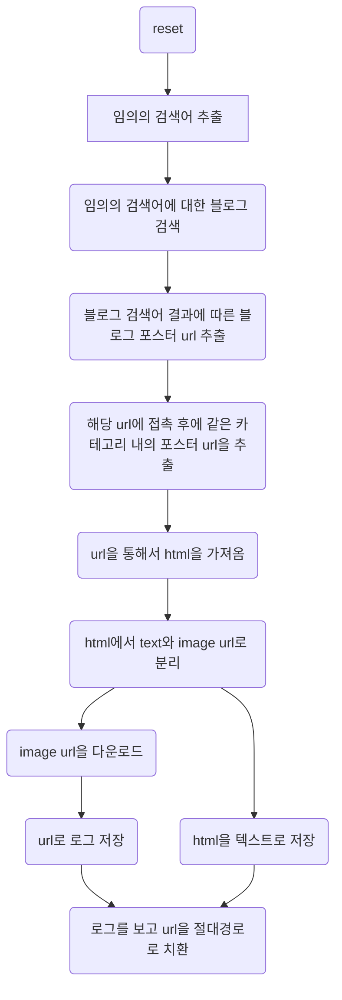

# 이미지 크롤러 소개 및 사용법
## 크롤러 소개

###이미지 크롤러
* 목적: 자동화를 통해, 임의의 블로그와 접촉해 HTML을 가져옵니다. 얻어온 HTML을 컴퓨터에 HTML로 저장하는 것을 목표로 하고 있습니다.

* * *

##이미지 크롤러 사용법
--------------------------
###목차
[TOC]

--------------------------
###실행법

* 사용법
```
parsing_blog2.py  -p FILE_PATH (-a) -d [all,month,week,day] -q QUERY -n Number (-cn)
```

* Options
    * -p ,--path : 저장시킬 폴더명.  예를 들면 c:\downloadFolder를 입력한다.(필수)
    * -d ,--date : 시간 순으로 정렬. day, week, month, all이 있다.
    * -n ,--number: 블로그의 갯수를 카운트해서 해당 갯수만큼 블로그를 검색 하는 기능입니다. 생략이 가능합니다. 기본값은 100입니다.
    * -a ,--auto: 쿼리어를 인터넷의 단어를 통해서 얻어와 자동적으로 입력해주는 기능입니다. 생략이 가능합니다.
    * -q ,--query: 검색할 검색어 명. 검색하고 싶은 단어를 입력한다. 만약 auto기능을 사용할 경우에는 query값을 무시한다. (필수)
    * -cn,--categoryno: 기본값으로 블로그의 같은 카테고리에 있는 글들을 가져오지만 해당 옵션을 붙이게 되면 검색어에 노출된 url만 검색을 하도록 합니다. 
* Example>
	```
 parsing_blog2.py -p c:/folder_name/ -a -q "" -d week -n 100 -cn
  pyhton3 parsing_blog2.py -p c:/folder_name/ -q "검색어" -d day -cn
    ```

--------------------------
###입력 변수

####Query
Query는 자신이 찾고자 하는 검색어를 입력하는 부분입니다. -q "검색어" 또는 -q 검색어 를 사용하는데 전자의 경우가 옳은 표현입니다.

####Path
파일 경로는 입력한 앞의 첫 글자를 자신이 사용할 드라이브의 위치로 파악을 합니다. 그리고 나머지 글자들을 자신이 사용할 폴더의 명으로 사용하며 백슬레시의 갯수를 크게 신경쓰지 않습니다. 옳바른 표기법이라 함은 c:\파일경로\  입니다.

####Auto
Query어를 자동적으로 입력 할 수 있도록 사용하는 변수입니다. --auto 또는 -a를 입력시에 계속해서 검색할 수 있도록 검색어를 추출한 후에 자동적으로 쿼리에 입력해줍니다.

####Date
Date는 전체, 1달, 1주일, 1일 단위로 검색할 수 있으며 각각 All, Month, Week, Day로 입력해주시면 됩니다. 

####Number
검색하고자하는 블로그의 갯수를 지정할 수 있습니다. 기본값은 100으로 검색한 결과의 100개의 블로그의 url에 접촉해서 각 url을 검사합니다.

####Categoryno
카테고리에 있는 모든 글을 가져오면 많은 자료들과 임의의 html을 가져올 수 있겠지만 해당 옵션을 이용하면 검색어에 노출된 블로그의 url만 들어가게 되므로 정확성이 향상되고 원하는 결과만 얻어올 수 있습니다.
----------------------------
###URL 분석

#### URL
	https://m.search.naver.com/search.naver?where=m_blog&query=' + query_ + '&display=' + display_ + '&start=' + start_ + '&st=' + st_
#### &query
query는 사용자가 검색하고 싶은 검색어명이다.
#### &display
display는 표준 15개를 기준으로 하고 있습니다. 몇 개의 url을 화면에 띄울 것인지 결정하는 변수입니다.
#### &start
start는 start=start+display를 통해서 url의 출력을 몇 번째에서부터 보여줄 것인지 결정하는 변수입니다.
#### &st
st는 date와 sim이 있습니다. date는 시간순 정렬이고 sim은 정확도순 정렬입니다. 해당 크롤러에서는 시간순으로 출력하기 위해서 date를 사용하고 있습니다.

----------------------------

###순서도


   
###로그 관련 도움말
로그는 성공한 로그, 성공과 실패한 로그 총 2가지의 로그를 갖고 있습니다.

####-Success_Log_File
성공한 로그 파일은 아래와 같이 URL이 저장이 됩니다.

[시간] 성공여부 URL 파일경로

```
[2016-08-05_09:52:27]	Done	http://mblogthumb3.phinf.naver.net/20160805_102/example_1470386696256nPlrK_JPEG/title_%281%29.jpg?type=w2		c:/01010101/http___m_blog_naver_com_example\http___m_blog_naver_com_example_220784221774_index_0.jpg	
```

####-Total_Log_File
모든 로그 파일은 아래와 같이 저장이 됩니다.
[시간] 성공여부 URL 파일경로 (에러메시지)
```		
[2016-08-05_09:52:27]	Done	http://mblogthumb3.phinf.naver.net/20160805_102/example_1470386696256nPlrK_JPEG/title_%281%29.jpg?type=w2		c:/example/http___m_blog_naver_com_example\http___m_blog_naver_com_example_blog_220784221774_index_0.jpg	

```
####Search_Word_history
검색어에 대한 로그는 아래와 같이 저장이 됩니다.
[시간] 검색어 페이지 date
```
[2016-08-29_14:20:16]	예시	0	month
```

 		 

### Except
####오류 목록
```
#urllib.request.urlopen(url, timeout=10)에서 오류가 발생합니다.
#ConnectionResetError는 [WinError 10054] 현재 연결은 원격 호스트에 의해서 강제로 끊겼습니다. 라는 오류를 냅니다.
#ConnectionAbortedError는 fname,header = urllib.request.urlretrieve(url,file_path)에서 오류 발생합니다.
#ConnectionAbortedError는 Winerror 10053 현재 연결이 호스트 시스템의 소프트웨어에 의해 종료시에 오류 발생.
#ssl.CertificateError는 hostname 'abc.go.kr' doesn't match '*.argc.go.kr'라는 오류를 입니다.
#ssl.CertificateError는 a=urllib.request.urlopen(url,timeout=10)에서 발생합니다.
#urllib.error.URLError는 <urlopen error timed out>과 같은 오류를 발생시킵니다.
#urllib.error.URLError는 urllib.request.urlopen()에서 발생합니다.
#socket.timeout는 urllib.request.urlopen()에서 설정한 timeout보다 시간이 초과되면 발생하는 오류입니다.
#socket.timeout는 a=urllib.request.urlopen(url,timeout=10)에서 발생합니다.
#urllib.error.HTTPError는 http error가 일어난다면 오류가 발생한다. ex) HTTP Error 404: Not Found
#urllib.error.HTTPError는 a=urllib.request.urlopen(url,timeout=10)에서 발생합니다.
#해당 오류는 a=urllib.request.urlretrieve()에서도 발생합니다.
```